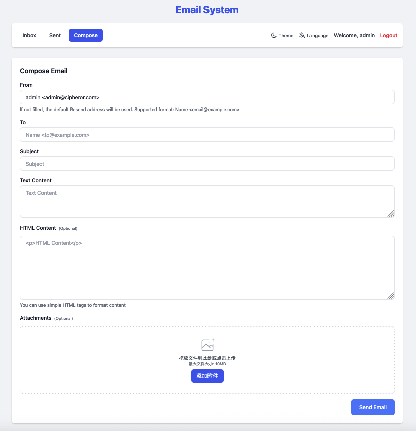
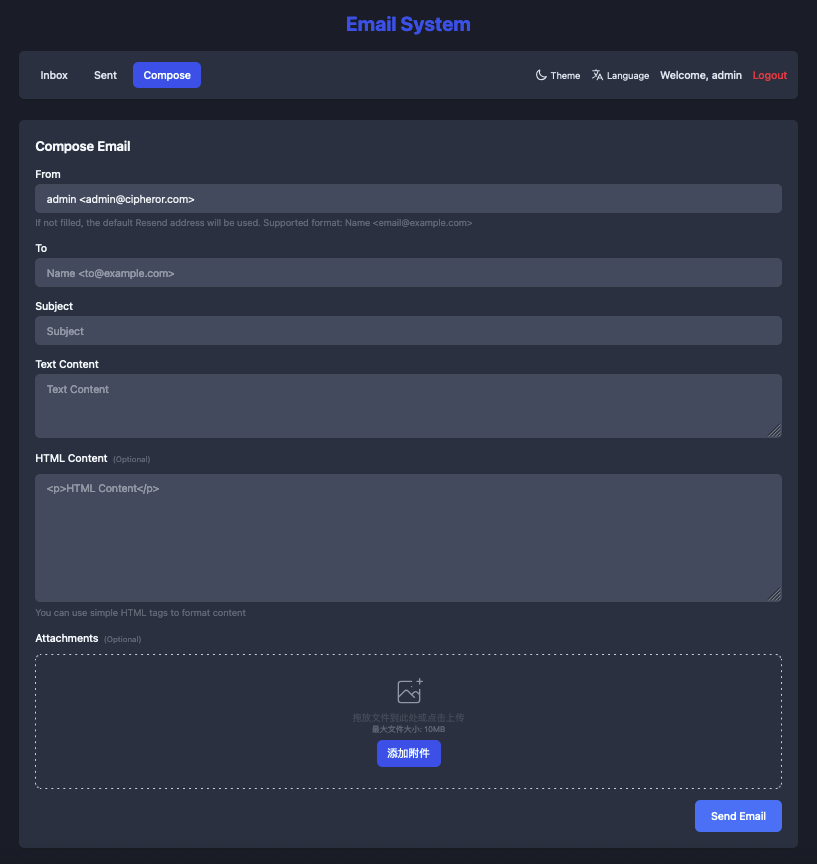

<div align="center">
  <h1>Cloudflare Workers 邮件系统</h1>
  <p> <a href="/README.md">English</a> | 简体中文</p>
  <p>这是一个使用 Cloudflare Workers 实现的邮件收发系统，前端可以直接查看收到的邮件内容以及发送邮件，发送功能通过 Resend API 实现。系统包含用户认证功能，确保只有授权用户可以访问邮件系统。</p>
</div>

## 功能特点

- ✉️ 发送邮件 (通过 Resend API)
- 📬 查看已发送的邮件
- 📨 查看收到的邮件
- 🔄 使用 Cloudflare KV 存储邮件数据
- 🎨 简洁现代的用户界面
- 🔐 基于环境变量的用户认证系统
- 📎 支持邮件附件

## 技术栈

- Cloudflare Workers
- Hono (轻量级 Web 框架)
- Resend API (邮件发送服务)
- Cloudflare KV (键值存储)
- Cloudflare R2 (对象存储，用于附件)
- Tailwind CSS (界面样式)

## 项目截图

### 收件箱


### 发件箱


### 写邮件


### 邮件详情


### 深色主题


## 一键部署

[](https://deploy.workers.cloudflare.com/?url=https://github.com/cipherorcom/emails)

你可以使用上方的"Deploy to Cloudflare"按钮一键部署此项目到你的 Cloudflare 账户。部署过程中，你需要：

1. 申请 [Resend Key](https://resend.com)
2. 登录你的 Cloudflare 账户 
3. 设置环境变量
   |变量名|值|说明|
   |------|-----|-----|
   |EMAIL_STORE|`email-store`|绑定KV命名空间|
   |EMAIL_ATTACHMENTS|`email-attachments`|绑定R2存储桶|
   |RESEND_API_KEY|string|在 Resend 申请的API Key|
   |AUTH_USER|string|登录的用户名|
   |AUTH_PASSWORD|string|登录的密码|
   |AUTH_EMAIL|`admin <admin@example.com>` \| `admin@example.com`|默认发件人|


## 项目设置

### 1. 配置 Resend API

首先，你需要在 [Resend](https://resend.com) 上创建一个账户并获取 API 密钥。

### 2. 配置 Cloudflare Workers

在部署前，请确保修改 `wrangler.toml` 配置文件中的以下内容：

```toml
# KV 命名空间需要在 Cloudflare 控制台创建
[[kv_namespaces]]
binding = "EMAIL_STORE"
id = "实际的KV ID" # 替换为你创建的 KV 命名空间 ID
preview_id = "本地开发使用的 KV ID" # 本地开发时使用

# R2 存储桶用于存储邮件附件
[[r2_buckets]]
binding = "EMAIL_ATTACHMENTS"
bucket_name = "email-attachments" # 替换为你创建的 R2 存储桶名称
preview_bucket_name = "email-attachments-dev" # 本地开发时使用

# 环境变量
[vars]
# Resend 邮件服务的 API Key
RESEND_API_KEY = "你的 Resend API Key" # 替换为你的 Resend API 密钥

# 登录认证信息
AUTH_USER = "admin"      # 登录用户名
AUTH_PASSWORD = "admin123"  # 登录密码
AUTH_EMAIL = "admin@example.com"  # 用户邮箱，用于发送邮件的默认发件人
```

### 3. 安装依赖并运行

```bash
# 安装依赖
npm install

# 本地开发
npx wrangler dev

# 部署
npx wrangler deploy
```

## 接收邮件设置

要接收邮件，你需要在 Cloudflare 控制台中设置邮件路由：

1. 登录 Cloudflare 控制台
2. 导航到 "Email" > "Email Routing"
3. 设置你的域名并创建邮件路由
4. 创建一个将邮件转发到你的 Worker 的规则

## 项目结构

```
├── src/
│   ├── index.js          # 主应用入口
│   ├── components/       # UI 组件
│   │   └── AttachmentUploader.js # 附件上传组件
│   ├── api/              # API 处理模块
│   │   ├── settings.js   # 设置相关 API
│   │   └── attachments.js # 附件处理 API
│   ├── i18n/             # 国际化支持
│   │   ├── index.js      # 国际化入口
│   │   ├── zh-CN.js      # 中文翻译
│   │   └── en-US.js      # 英文翻译
│   ├── utils/            # 工具函数
│   │   └── attachments.js # 附件处理工具
│   └── db/               # 数据库操作相关
│       └── auth.js       # 用户认证处理
├── wrangler.toml         # Cloudflare Workers 配置
└── package.json          # 项目依赖
```

## 使用说明

访问应用根目录可以看到以下页面：

- `/` - 收件箱页面，展示接收到的邮件
- `/sent` - 已发送页面，展示已发送的邮件
- `/compose` - 写邮件页面，用于发送新邮件
- `/login` - 登录页面，使用环境变量中配置的用户名和密码登录

## API 端点

- `POST /api/send` - 发送邮件
- `GET /api/emails` - 获取所有邮件
- `POST /api/login` - 用户登录
- `POST /api/logout` - 用户登出
- `POST /api/attachments/upload` - 上传附件
- `GET /api/attachments/:id` - 获取附件
- `DELETE /api/attachments/:id` - 删除附件

## 开源许可

本项目采用 MIT 许可证授权 - 详情请参阅 [LICENSE](LICENSE) 文件。
